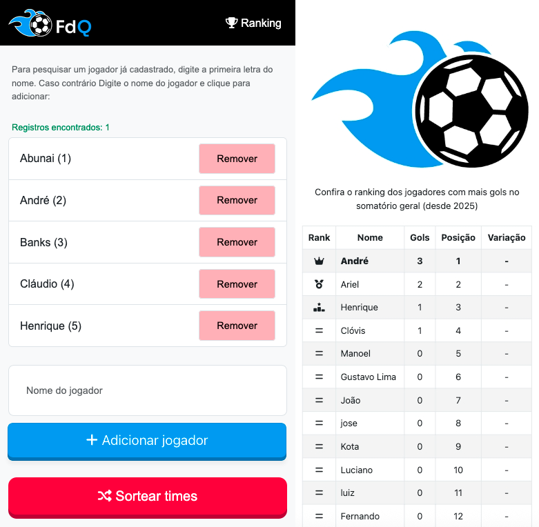

# Fut de Quarta - Documentação do Sistema

## Descrição do Sistema

"Fut de Quarta" é uma aplicação web projetada para gerenciar e organizar partidas de futebol, especialmente para jogos casuais semanais. O sistema permite aos usuários registrar jogadores, sortear times, rastrear placares e gols, além de lidar com substituições e rotações de times com base nos resultados das partidas. Possui uma interface amigável construída com HTML, CSS (Bootstrap) e JavaScript, com suporte backend via PHP e MySQL para persistência de estado. O sistema é destinado a uso em ambientes sociais ou comunitários, garantindo rotações justas de times e mantendo estatísticas de jogo.

## Regras

1. Cada partida envolve dois times, A e B, com 5 jogadores cada.
2. Uma partida termina quando um time marca 2 gols ou o cronômetro de 10 minutos expira.
3. O time vencedor permanece na mesma posição (A ou B), enquanto o time perdedor é substituído.
4. O time perdedor é movido para a última fila de "próximos times", e o primeiro "próximo time" entra no jogo.
5. Se o primeiro "próximo time" tiver menos de 5 jogadores (ex.: 3), ele é completado com jogadores aleatórios do time perdedor até atingir 5.
6. Os jogadores restantes do time perdedor (ex.: 3 após ceder 2) são movidos para a primeira fila de "próximos times".
7. Em caso de empate (0-0 ao fim do tempo), o último time vencedor (ou o Time A por padrão) é considerado o vencedor, a menos que haja pelo menos 2 "próximos times" disponíveis.
8. Jogadores podem ser adicionados ou removidos durante o jogo, com novos jogadores adicionados ao primeiro "próximo time".
9. Substituições são permitidas entre jogadores dos times atuais e "próximos times" por meio de uma interface modal.

## Requisitos Funcionais

1. **Gerenciamento de Jogadores**:
   - Permitir que os usuários insiram e registrem novos jogadores.
   - Exibir uma lista de jogadores selecionados para o sorteio de times.
   - Possibilitar a remoção de jogadores da lista de seleção.
2. **Sorteio de Times**:
   - Sortear aleatoriamente os jogadores selecionados em dois times (A e B) de 5 cada.
   - Gerar "próximos times" a partir dos jogadores restantes, com até 5 por time.
3. **Gerenciamento de Partidas**:
   - Iniciar e pausar um cronômetro de 10 minutos para a partida.
   - Registrar gols para cada time, atribuindo-os a jogadores específicos.
   - Encerrar a partida com base em uma vantagem de 2 gols ou expiração do tempo.
4. **Rotação de Times**:
   - Substituir automaticamente o time perdedor pelo primeiro "próximo time" após uma partida.
   - Completar "próximos times" incompletos (menos de 5 jogadores) com jogadores aleatórios do time perdedor.
   - Mover o time perdedor para a última fila de "próximos times".
5. **Substituição e Remoção**:
   - Permitir a substituição de jogadores entre times atuais e "próximos times" via modal.
   - Possibilitar a remoção de jogadores dos times atuais, movendo-os para o primeiro "próximo time".
   - Permitir a remoção de jogadores dos "próximos times".
6. **Estatísticas**:
   - Exibir estatísticas da partida (placar, tempo, artilheiros) ao final de cada jogo.
   - Fornecer estatísticas diárias e gerais (partidas jogadas, tempo total, artilheiros, times mais vitoriosos).
7. **Persistência de Estado**:
   - Salvar e carregar o estado do jogo (times, placares, histórico) usando um banco de dados MySQL.

## Requisitos Não Funcionais

1. **Usabilidade**:
   - A interface deve ser intuitiva, com botões e exibições claras, adequada para usuários não técnicos.
   - Design responsivo para suportar dispositivos móveis e desktops.
2. **Desempenho**:
   - O sistema deve lidar com até 30 jogadores e 10 "próximos times" sem atrasos significativos.
   - Atualizações do cronômetro devem ocorrer a cada segundo sem atraso.
3. **Confiabilidade**:
   - O estado deve ser salvo de forma confiável para evitar perda de dados durante interrupções.
   - A lógica da partida (ex.: rotação de times, contagem de gols) deve ser consistente entre sessões.
4. **Segurança**:
   - Os dados dos jogadores e o estado do jogo devem ser armazenados de forma segura no banco de dados.
   - Operações sensíveis (ex.: exclusão de todos os dados) não devem estar disponíveis sem confirmação.
5. **Escalabilidade**:
   - O sistema deve suportar a adição de novos recursos (ex.: múltiplos campos, ligas) com mínima refatoração.
6. **Compatibilidade**:
   - Deve funcionar em navegadores modernos (Chrome, Firefox, Safari) com acesso à internet para recursos CDN.

## Regras de Negócio

1. **Composição de Times**:
   - Cada time deve ter exatamente 5 jogadores para iniciar uma partida.
   - "Próximos times" podem ter menos de 5 jogadores, mas o time que entra deve ser completado para 5.
2. **Duração e Pontuação da Partida**:
   - Uma partida dura 10 minutos, a menos que um time marque 2 gols primeiro.
   - Gols são atribuídos a jogadores individuais, rastreados durante a sessão.
3. **Lógica de Rotação**:
   - O time perdedor é totalmente substituído, movendo todos os 5 jogadores para a última fila de "próximos times".
   - O primeiro "próximo time" entra, com jogadores aleatórios do time perdedor adicionados se necessário, e o restante do time perdedor vai para o primeiro "próximo time" sem duplicatas.
4. **Manuseio de Empates**:
   - Em um empate 0-0, o último time vencedor mantém sua posição; caso contrário, o vencedor padrão é o Time A.
5. **Gerenciamento de Jogadores**:
   - Novos jogadores são adicionados ao primeiro "próximo time" se o jogo estiver ativo.
   - Jogadores removidos dos times atuais são movidos para o primeiro "próximo time".
6. **Relatórios de Estatísticas**:
   - Estatísticas diárias incluem o número de partidas, tempo total jogado e artilheiro.
   - Estatísticas gerais incluem dias jogados, artilheiros e times mais vitoriosos.
